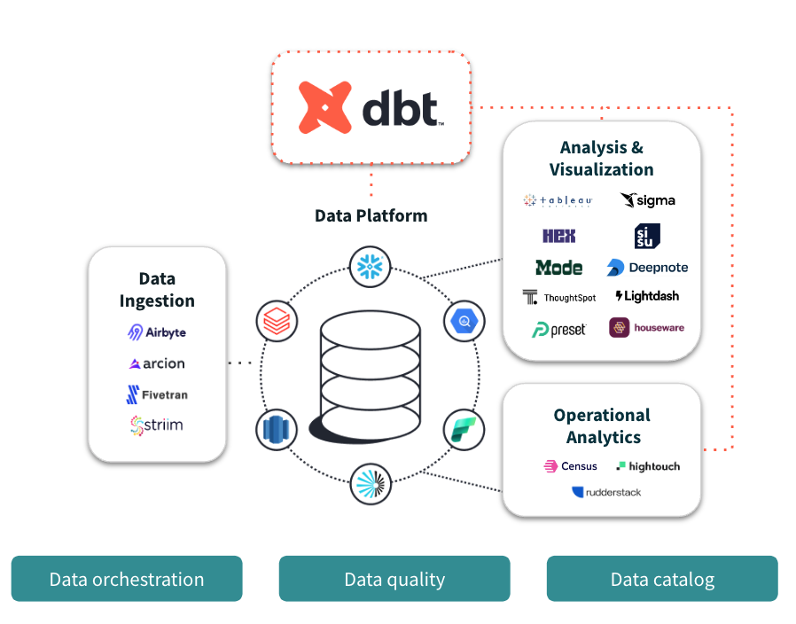

# DBT 介绍

dbt 是一种转换工作流程，能帮助我们完成数据工程以及数据科学的很多工作，同时产生更高质量的结果。它支持我们模块化和集中化分析代码，同时还为数据团队提供软件工程工作流程中常见的护栏。在将查询安全部署到生产环境之前，通过监控和可视性，协作处理数据模型、对它们进行版本控制、测试和记录您的查询。

dbt 针对数据平台编译并运行分析代码，使团队能够在指标、见解和业务定义的单一事实来源上进行协作。这种单一事实来源与为数据定义测试的能力相结合，可以减少逻辑变化时的错误，并在出现问题时发出警报。

在 [dbt Viewpoint](https://docs.getdbt.com/community/resources/viewpoint) 中详细了解为什么我们希望让分析师能够更像软件工程师一样工作。[加入 dbt 社区](https://www.getdbt.com/community/join-the-community)，了解世界各地的其他数据从业者如何使用 dbt。

## 1. DBT 产品

通过 DBT 可以按照版本控制、模块化、可移植性、CI/CD 和文档等软件工程最佳实践的方式快速协作地转换数据，并部署分析代码。这意味着数据团队中熟悉 SQL 的任何人都可以安全地为生产级数据管道做出贡献。

### 1.1 DBT Cloud

### 1.1 DBT Core